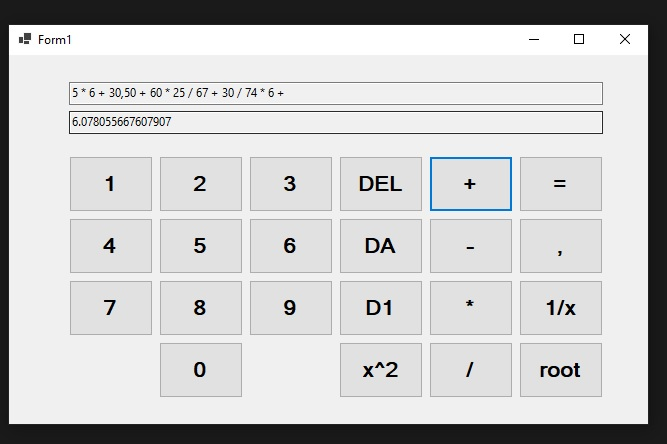
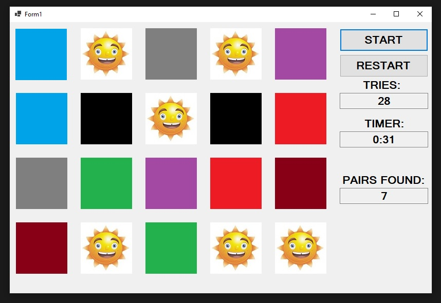

# Content
This Repository currently contains files for the following projects in C# using Windows Forms:

# Simple programs
## A calculator
  
- Basic arithmetic operations
- Some special operations like "inverse"

## A memory game
  
- Timer feature which starts when the start button is pressed and stops when all pairs have been found
- Counts the tries until all pairs have been found

# Programs with a touch of electrical science
## Program for Star-Delta-Transformation calculation
  
- with error handling for invalid inputs
- invalid inputs are:
  - empty textboxes
  - the use of non digits
  - zero or negative values for the resistors
- in case of an error, a message box will show up with further detailed information

## Impedance Calculator

- Handles impedances when adding serial and parallel ideal components correctly
- Frequency can be freely adjusted
- For ease to input values, toggle buttons for unit prefix can be used (kilo, milli, mikro µ and nano)
- Uses the 'Complex Struct' to calculate with complex numbers/ values of the components - see here:  
  https://learn.microsoft.com/en-us/dotnet/api/system.numerics.complex?view=net-8.0

### Validation/ Verification of Impedance Calculator
- To verify the correct program behavior I used an old exercise

    
- Due to the structure of the program I have to start from the outermost components - the two capacitors and resistor.
- The nano toggle button for the capacitor and kilo toggle button for the resistor works as inteded
- After further input of the inductor and last resistor the programs is in the state of the UI screenshot as shown further above
- The right values can be validated with the results
- [Video which shows this exercise](https://drive.google.com/file/d/118y5wbZ0eJ8UPwxWVg7EMrRSjVxhzm4O/view?usp=drive_link)

  

# Programs for math problems
## Matrice operations

- error handling for invalid inputs(same as in the Star-Delta-Calculator)
- basic matrice operations
- can calculate determinant of a 3x3 matrix using the *Rule of Sarrus* https://en.wikipedia.org/wiki/Rule_of_Sarrus
- can calculate inverse of a 3x3 matrix using the adjunct transposed matrix and the determinant
- in case of no determinante/ 0-determinante an error window will pop up because no inverse exists
